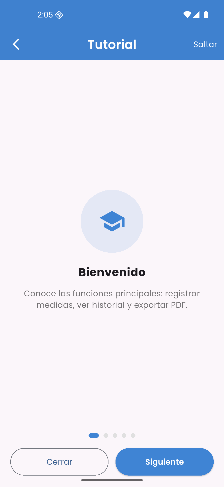
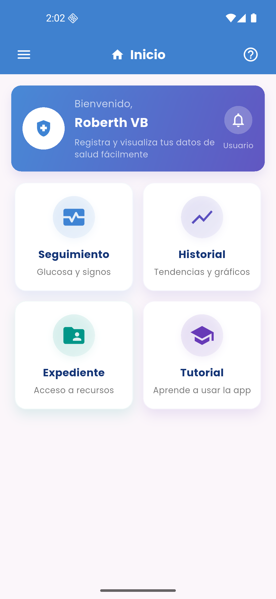
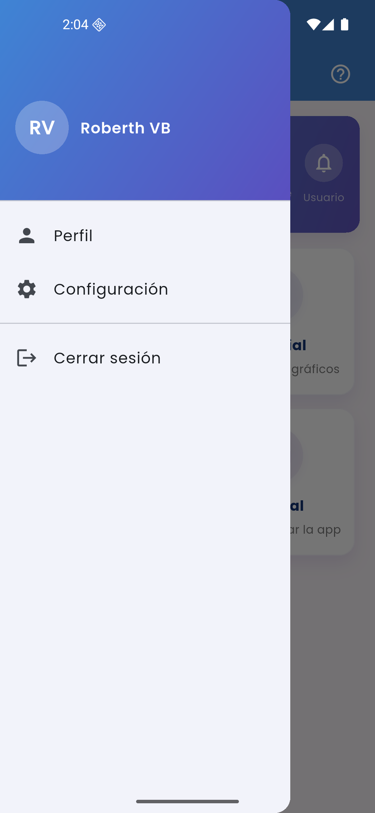
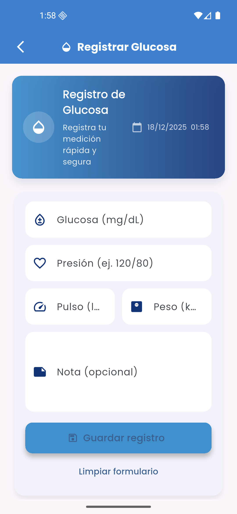
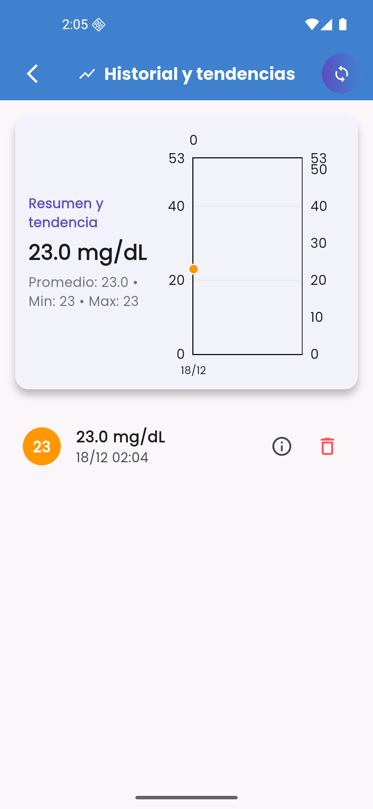
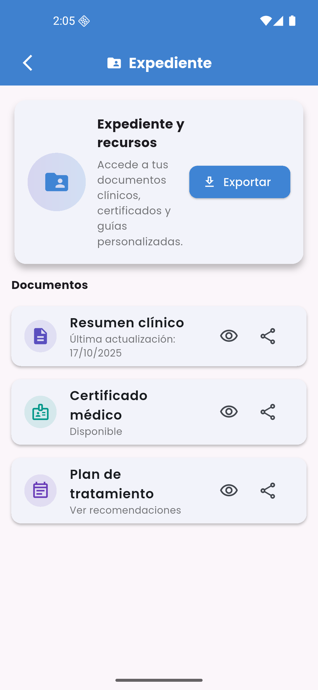
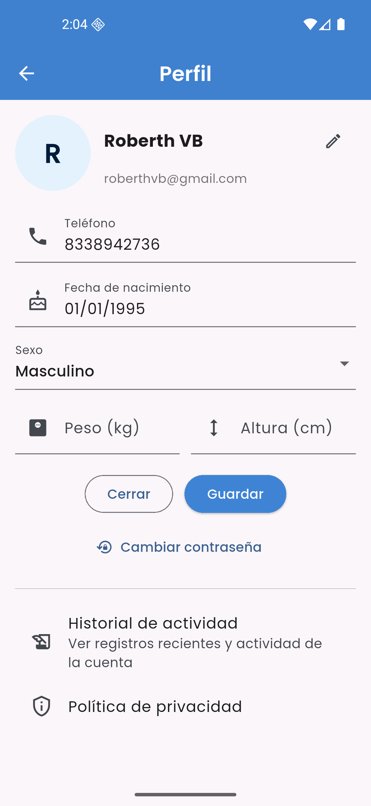

# 🏥 Sistema Integral de Salud

<p align="center">
  
  
  
</p>

## 📋 Descripción

Sistema Integral es una aplicación móvil multiplataforma desarrollada en Flutter que permite a los usuarios gestionar y monitorear su información de salud de manera integral. La aplicación ofrece seguimiento de registros médicos, control de glucosa, recordatorios, generación de reportes en PDF y sincronización en la nube mediante Firebase.

## 📸 Capturas de Pantalla

<p align="center">
  
  
  
  
</p>

<p align="center">
  
  
  
  
</p>

## ✨ Características Principales

- 🔐 **Autenticación Segura**: Login con correo/contraseña y Google Sign-In
- 📊 **Registro de Glucosa**: Monitoreo y seguimiento de niveles de glucosa
- 📈 **Visualización de Datos**: Gráficos interactivos con FL Chart
- 📁 **Gestión de Expedientes**: Organización de información médica
- 🔔 **Recordatorios**: Sistema de notificaciones para medicamentos y citas
- 📄 **Exportación PDF**: Generación de reportes e historiales médicos
- 🌙 **Tema Oscuro/Claro**: Interfaz adaptable según preferencias del usuario
- ☁️ **Sincronización en la Nube**: Backup automático con Firebase Firestore
- 💾 **Base de Datos Local**: Almacenamiento offline con SQLite
- 📱 **Multiplataforma**: Soporte para Android y iOS.

## 🛠️ Tecnologías Utilizadas

### Framework y Lenguaje
- **Flutter** 3.7.0+
- **Dart** 3.7.0+

### Dependencias Principales

| Dependencia | Versión | Propósito |
|------------|---------|-----------|
| `firebase_core` | ^4.1.1 | Inicialización de Firebase |
| `firebase_auth` | ^6.1.0 | Autenticación de usuarios |
| `cloud_firestore` | ^6.0.2 | Base de datos en la nube |
| `google_sign_in` | ^6.1.0 | Autenticación con Google |
| `sqflite` | ^2.4.2 | Base de datos local SQLite |
| `fl_chart` | ^1.1.1 | Gráficos y visualizaciones |
| `pdf` | ^3.11.3 | Generación de documentos PDF |
| `printing` | ^5.14.2 | Impresión de documentos |
| `shared_preferences` | ^2.5.3 | Almacenamiento de preferencias |
| `google_fonts` | ^6.3.2 | Fuentes personalizadas |
| `intl` | ^0.20.2 | Internacionalización y formato de fechas |

## 📁 Estructura del Proyecto

```
lib/
├── main.dart                    # Punto de entrada de la aplicación
├── firebase_options.dart        # Configuración de Firebase
├── assets/                      # Recursos estáticos (imágenes, iconos)
├── Modelo/                      # Modelos de datos
│   ├── registro.dart
│   └── usuario.dart
├── Vista/                       # Interfaces de usuario
│   ├── login_pagina.dart
│   ├── actividad_pagina.dart
│   ├── configuracion_pagina.dart
│   ├── document_preview_pagina.dart
│   ├── expediente_pagina.dart
│   ├── exportar_pagina.dart
│   ├── historial_pagina.dart
│   ├── inicio_pagina.dart
│   ├── login_pagina.dart
│   ├── perfil_pagina.dart
│   ├── privacidad_pagina.dart
│   ├── recordatorio_pagina.dart
│   ├── registro_glucosa_pagina.dart
│   ├── registro_pagina.dart
│   ├── seguimiento_pagina.dart
│   ├── theme_service.dart
│   └── tutorial_pagina.dart 
├── Controlador/                 # Lógica de negocio
│   ├── login_controller.dart
│   └── registro_controller.dart
└── Servicios/                   # Servicios y utilidades
    └── activity_service.dart
```

## 🚀 Requisitos Previos

Antes de comenzar, asegúrate de tener instalado:

- [Flutter SDK](https://flutter.dev/docs/get-started/install) (3.7.0 o superior)
- [Dart SDK](https://dart.dev/get-dart) (3.7.0 o superior)
- [Android Studio](https://developer.android.com/studio) o [VS Code](https://code.visualstudio.com/)
- [Git](https://git-scm.com/)
- Una cuenta de [Firebase](https://firebase.google.com/)

### Para desarrollo Android:
- Android SDK (API 21 o superior)
- Java JDK 11 o superior

### Para desarrollo iOS:
- macOS con Xcode 12.0 o superior
- CocoaPods

## 📦 Instalación

### 1. Clonar el repositorio

```bash
git clone https://github.com/tu-usuario/sistema_integral.git
cd sistema_integral
```

### 2. Instalar dependencias

```bash
flutter pub get
```

### 3. Configurar Firebase

1. Crea un proyecto en [Firebase Console](https://console.firebase.google.com/)
2. Configura las aplicaciones Android e iOS en tu proyecto Firebase
3. Descarga los archivos de configuración:
   - `google-services.json` para Android → colocar en `android/app/`
   - `GoogleService-Info.plist` para iOS → colocar en `ios/Runner/`
4. Ejecuta FlutterFire CLI para generar configuraciones:

```bash
flutterfire configure
```

5. Habilita los siguientes servicios en Firebase Console:
   - **Authentication** (Email/Password y Google)
   - **Cloud Firestore**
   - **Storage** (opcional, para imágenes)

### 4. Ejecutar la aplicación

```bash
# Para Android
flutter run

# Para iOS
flutter run -d ios

```

## 🔧 Configuración Adicional

### Variables de Entorno

Las configuraciones de Firebase se manejan automáticamente a través de `firebase_options.dart`.

### Base de Datos Local

La aplicación utiliza SQLite para almacenamiento local. Las tablas se crean automáticamente en el primer inicio.

## 📱 Funcionalidades Detalladas

### Autenticación
- Registro de nuevos usuarios con email y contraseña
- Login con Google Sign-In
- Recuperación de contraseña
- Validación de sesión persistente

### Gestión de Salud
- **Registro de Glucosa**: Añadir, editar y eliminar mediciones
- **Visualización Gráfica**: Seguimiento visual de tendencias
- **Expedientes Médicos**: Almacenamiento de documentos e información clínica
- **Recordatorios**: Alertas para medicación y citas médicas

### Reportes y Exportación
- Generación de PDFs con historial médico
- Exportación de datos en formato estructurado
- Vista previa de documentos antes de compartir

### Configuración
- Cambio entre tema claro y oscuro
- Gestión de preferencias de usuario
- Privacidad y seguridad de datos

## 🧪 Pruebas

Ejecutar las pruebas unitarias:

```bash
flutter test
```

Ejecutar pruebas con cobertura:

```bash
flutter test --coverage
```

## 🤝 Contribuciones

Las contribuciones son bienvenidas. Por favor:

1. Fork el proyecto
2. Crea una rama para tu funcionalidad (`git checkout -b feature/NuevaFuncionalidad`)
3. Commit tus cambios (`git commit -m 'Añadir nueva funcionalidad'`)
4. Push a la rama (`git push origin feature/NuevaFuncionalidad`)
5. Abre un Pull Request

## 📄 Licencia

Este proyecto es privado y no está publicado en pub.dev.

---

**Nota**: Este proyecto requiere configuración adicional de Firebase para funcionar correctamente. Asegúrate de seguir todos los pasos de instalación.
